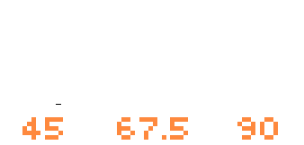

# Bonfire

> Build RPG games and similar with the power of [FlameEngine](https://flame-engine.org/)!

This tool was built over [FlameEngine](https://flame-engine.org/) and all its resources and classes are available to be used along with Bonfire. With that said, it is recommended to give a look into [FlameEngine](https://flame-engine.org/) before you start doing something with Bonfire.

This is ideal for building games from the following perspectives:

We have a Bonfire help channel on Fireslime's Discord, join it [here](https://discord.com/invite/pxrBmy4).

Bonfire presentation at [FlameCon](https://www.youtube.com/watch?v=2DdiNrAAuBg&t=2s).