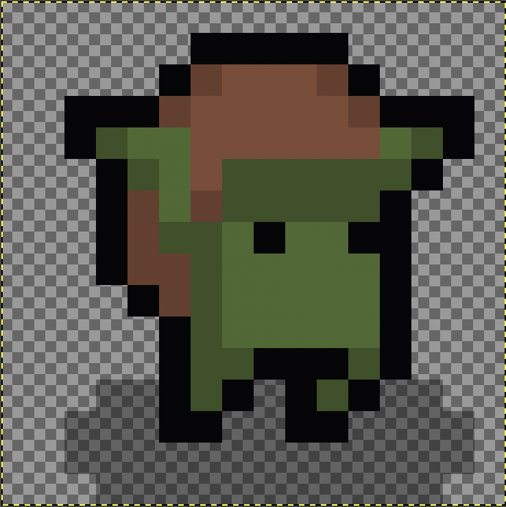
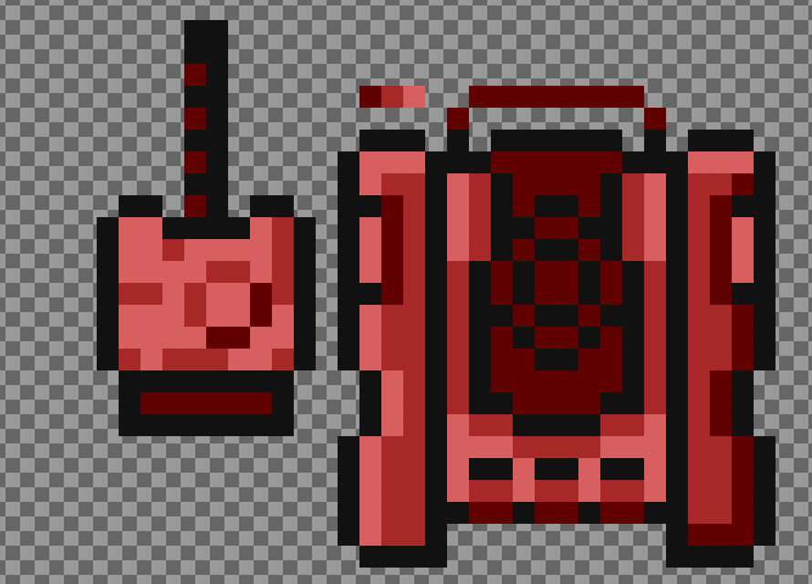

# Enemy
> <small>This is a [GameComponent](https://github.com/RafaelBarbosatec/bonfire/blob/1.0.0-rc/lib/base/game_component.dart) that uses [Movement](https://github.com/RafaelBarbosatec/bonfire/blob/1.0.0-rc/lib/util/mixins/movement.dart) and [Attackable](https://github.com/RafaelBarbosatec/bonfire/blob/1.0.0-rc/lib/util/mixins/attackable.dart) mixins.</small>

Create an enemy in the game. Instances of this class have predefined behaviors ready to be used and configured as wanted. All the actions and movements are customizable.

There are two types of enemies: `SimpleEnemy` and `RotationEnemy`:

## SimpleEnemy

> <small>This is an [Enemy](#Enemy)</small>

</img>

Used for 45º and 67.5º perspectives. We can configure motion animations for all directions (up, down, left, right, up_right, up_left, down_left, down_right).

To use it, simply create a class that will represent your enemy and extend SimpleEnemy:

```dart

class Goblin extends SimpleEnemy {

    Goblin(Vector2 position)
      : super(
          position: position, //required
          height: 32.0, //required
          width: 32.0, //required
          life: 100,
          speed: 100,
          initDirection: Direction.right,
          animation: SimpleDirectionAnimation(
            idleLeft: Future<SpriteAnimation>(), //required
            idleRight: Future<SpriteAnimation>(), //required
            runLeft: Future<SpriteAnimation>(), //required
            runRight: Future<SpriteAnimation>(), //required
            idleUp: Future<SpriteAnimation>(),
            idleDown: Future<SpriteAnimation>(),
            idleUpLeft: Future<SpriteAnimation>(),
            idleUpRight: Future<SpriteAnimation>(),
            idleDownLeft: Future<SpriteAnimation>(),
            idleDownRight: Future<SpriteAnimation>(),
            runUp: Future<SpriteAnimation>(),
            runDown: Future<SpriteAnimation>(),
            runUpLeft: Future<SpriteAnimation>(),
            runUpRight: Future<SpriteAnimation>(),
            runDownLeft: Future<SpriteAnimation>(),
            runDownRight: Future<SpriteAnimation>(),
          ),
      );

    @override
    void update(double dt) {
      // Do anything
      super.update(dt);
    }

    @override
    void render(Canvas canvas) {
      // Do anything
      super.render(canvas);
    }

    @override
    void receiveDamage(double damage, int from) {
      /// Called when the enemy receive damage
      super.receiveDamage(damage, from);
    }

    @override
    void die() {
      /// Called when the enemy die
      super.die();
    }
}

```

Now that you have a class that represents your enemy, you can configure their behavior.

There are several useful extensions that you can use inside the `update` method that will help you with this task:


```dart 
void seePlayer({
    required Function(Player) observed,
    VoidCallback? notObserved,
    double radiusVision = 32,
  })
```
It will trigger a callback function once the player is within the enemy's radiusVision.


```dart 
void seeAndMoveToPlayer({
    required Function(Player) closePlayer,
    double radiusVision = 32,
    double margin = 10,
  })
```
The enemy will move in the direction of the player once it gets within the radiusVision. When it gets close to the player, `closePlayer` will be fired.


```dart 
void simpleAttackMelee({
    required double damage,
    required height = 32,
    required width = 32,
    int? id,
    int interval = 1000,
    bool withPush = false,
    double? sizePush,
    Direction? direction,
    Future<SpriteAnimation>? attackEffectRightAnim,
    Future<SpriteAnimation>? attackEffectBottomAnim,
    Future<SpriteAnimation>? attackEffectLeftAnim,
    Future<SpriteAnimation>? attackEffectTopAnim,
    VoidCallback? execute,
  })
```
Executes a physical attack to the player, making the configured damage with the configured frequency. You can add animations to represent this attack.


```dart 
void simpleAttackRange({
    required Future<SpriteAnimation> animationRight,
    required Future<SpriteAnimation> animationLeft,
    required Future<SpriteAnimation> animationTop,
    required Future<SpriteAnimation> animationBottom,
    required Future<SpriteAnimation> animationDestroy,
    required double width,
    required double height,
    int? id,
    double speed = 150,
    double damage = 1,
    Direction? direction,
    int interval = 1000,
    bool withCollision = true,
    CollisionConfig? collision,
    VoidCallback? destroy,
    VoidCallback? execute,
    LightingConfig? lightingConfig,
  })
```
Executes a distance attack. It will add a `FlyingAttackObject` to the game and this will be sent in the configured direction, making some damage to whomever it hits or being destroyed when hitting barriers (tiles with collision).


```dart 
void seeAndMoveToAttackRange({
    required Function(Player) positioned,
    double radiusVision = 32,
    double? minDistanceCellsFromPlayer,
  })
```
When the player is within the radiusVision, the enemy will position itself to perform a distance attack. Once it reaches the attack position, the `positioned` callback will be fired.


Other useful functions:

```dart 
  // Displays the damage value in the game with an animation.
  void showDamage(
    double damage,
    {
      TextConfig? config,
      double initVelocityTop = -5,
      double gravity = 0.5,
      double maxDownSize = 20,
      DirectionTextDamage direction = DirectionTextDamage.RANDOM,
      bool onlyUp = false,
    }
  )
  
  // Gives the direction of the player in relation to this enemy
  Direction directionThatPlayerIs()
  
  // Restore life points to the enemy
  void addLife(double life)

  // Draws the default life bar. Should be used inside the `render` method.
  void drawDefaultLifeBar(
    Canvas canvas,
    {
      bool drawInBottom = false,
      double padding = 5,
      double strokeWidth = 2,
    }
  )
```


If you want to add quick animations, like effects of taking damage or making a special attack, you can use the method `addFastAnimation`:

```dart 
this.animation.playOnce(
  Future<SpriteAnimation> animation,
  Vector2Rect position, 
  {
    VoidCallback? onFinish,
    bool runToTheEnd = false,
  }
)
```

Note: Enemies only move if they are visible in the camera. if you want to disable this, add false in `collisionOnlyVisibleScreen` in your collision config. See [Colission System](collision_system).

Complete SimpleEnemy example [here](https://github.com/RafaelBarbosatec/bonfire/blob/master/example/lib/shared/enemy/goblin.dart).


## RotationEnemy

> <small>This is an [Enemy](#Enemy)</small>

</img>

Used for 90º perspectives. And we can configure Motion animations for run and idle.

```dart

class Tank extends RotationEnemy {

    Tank(Vector2 position)
      : super(
          position: position, //required
          animIdle: Future<SpriteAnimation>(), //required
          animRun: Future<SpriteAnimation>(), //required
          height: 32.0, 
          width: 32.0, 
          life: 100,
          speed: 100,
          currentRadAngle: -1.55, 
      );

    @override
    void update(double dt) {
      // do anything
      super.update(dt);
    }

    @override
    void render(Canvas canvas) {
      // do anything
      super.render(canvas);
    }

    @override
    void receiveDamage(double damage, int from) {
      super.receiveDamage(damage, from);
    }

    @override
    void die() {
      super.die();
    }
}

```

Now that we have our class that represents our enemy, we can configure their behavior.

There are several useful extensions that we can use in `update` that will help us to configure these movements:

```dart 
void seePlayer({
    required Function(Player) observed,
    VoidCallback? notObserved,
    double radiusVision = 32,
  })
```

```dart 
 void seeAndMoveToPlayer({
    required Function(Player) closePlayer,
    double radiusVision = 32,
    double margin = 10,
  })
```

```dart 
void seeAndMoveToAttackRange({
    required Function(Player) positioned,
    double radiusVision = 32,
    double? minDistanceCellsFromPlayer,
  })
```

```dart 
void simpleAttackMelee({
    required Future<SpriteAnimation> attackEffectTopAnim,
    required double damage,
    required double height,
    required double width,
    int? id,
    bool withPush = false,
    double? radAngleDirection,
    VoidCallback? execute,
    int interval = 1000,
  })
```

```dart 
void simpleAttackRange({
    required Future<SpriteAnimation> animationTop,
    required Future<SpriteAnimation> animationDestroy,
    required double width,
    required double height,
    int? id,
    double speed = 150,
    double damage = 1,
    double? radAngleDirection,
    int interval = 1000,
    bool withCollision = true,
    bool collisionOnlyVisibleObjects = true,
    VoidCallback? destroy,
    CollisionConfig? collision,
    VoidCallback? execute,
    LightingConfig? lightingConfig,
  })

  String tileTypeBelow()

  List<String> tileTypesBelow()
  
```


## Custom

If none of these types of enemies do not meet your needs. You can create your own by extending the `Enemy` class.

With Enemy you will have access to the following methods:

* void moveUp(double speed)
* void moveDown(double speed)
* void moveLeft(double speed)
* void moveRight(double speed)
* void moveUpRight(double speedX, double speedY)
* void moveUpLeft(double speedX, double speedY)
* void moveDownLeft(double speedX, double speedY)
* void moveDownRight(double speedX, double speedY)
* void moveFromAngleDodgeObstacles(double speed, double angle,{Function notMove})
* void moveFromAngle(double speed, double angle)
* void receiveDamage(double damage, int from)
* void addLife(double life)
* void die()
