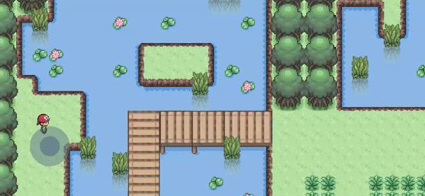

## Bonfire Example
[GitHub](https://github.com/RafaelBarbosatec/bonfire/tree/master/example)    -   [PLAY](https://bonfire-engine.github.io/examples/bonfire/)

## Darkness Dungeon
[GitHub](https://github.com/RafaelBarbosatec/darkness_dungeon) [PlayStore](https://play.google.com/store/apps/details?id=com.rafaelbarbosatec.darkness_dungeon) [AppleStore](https://apps.apple.com/us/app/darkness-dungeon/id1506675248)

## Mountain Fight (Multiplayer with Socket.io)
[GitHub](https://github.com/RafaelBarbosatec/mountain_fight)   -   [apk](https://bonfire-engine.github.io/apk/mountain.apk)   -   [PLAY](https://bonfire-engine.github.io/examples/mountain_fight/)

## Mini Fantasy
[GitHub](https://github.com/RafaelBarbosatec/mini_fantasy)   -   [PLAY](https://bonfire-engine.github.io/examples/mini_fantasy/)

## Multi Biome
[GitHub](https://github.com/RafaelBarbosatec/multi-biome)   -   [PLAY](https://bonfire-engine.github.io/examples/multi_biome/)

