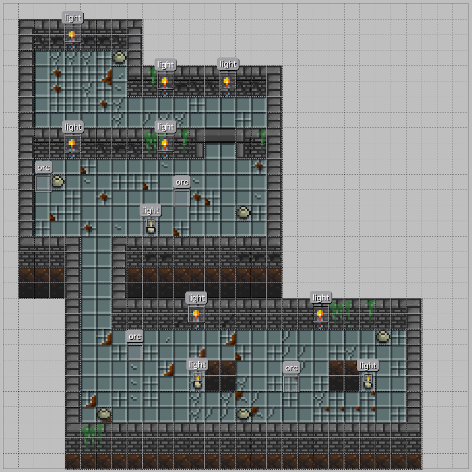

# Map

> Represents a map (or world) where the game occurs.

It is a matrix of small tiles that toghether assembles the map as seen below:



## Using

We currently recommend creating the map using [Tiled](https://www.mapeditor.org/). For that we use `TiledWorldMap` in `BonfireTiledWidget` in the `map` parameter:

```dart
TiledWorldMap('tile/map.json', forceTileSize: Size(32,32))
```

The first parameter (`tile/map.json`) is the path of the `.json` file exported by Tiled.

> IMPORTANT: Bonfire only supports .json files.

The second parameter (`Size(32,32)`) is optional and determines the size of each Tile on the map (squares). If not set it takes the default size defined by your TileSet.

## Adding objects

You can add objects like [Decorations](decoration) and [Enemies](enemy) to the map using the `registerObject` method:

```dart
    return BonfireTiledWidget(
        map: TiledWorldMap(
            'tiled/map.json',
            forceTileSize: Size(32,32),
            objectsBuilder: {
                'orc': (TiledObjectProperties properties) => Orc(properties.position),
            },
        ),
        ...
    );
```

Just create a layer of objects on your map and position it as in the example in the image above.

For more details about our Tiled support click [here](tiled_support).