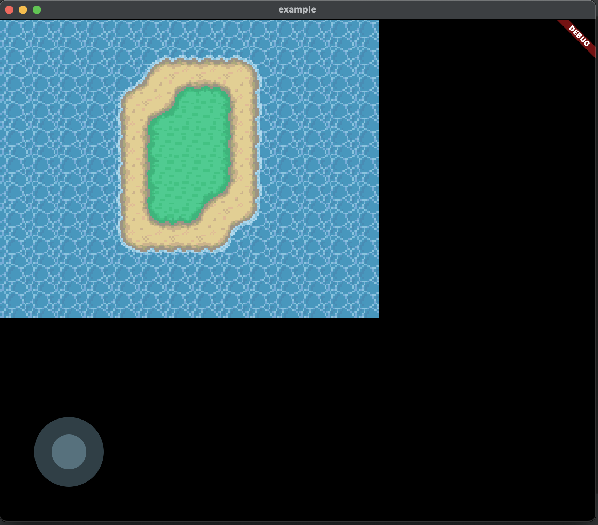

# Map

> Represents a map (or world) where the game occurs.

It is a matrix of small tiles that toghether assembles the map as seen below:


## Using

We currently recommend creating the map using [Tiled](https://www.mapeditor.org/). For that we use `TiledWorldMap` in `BonfireTiledWidget` in the `map` parameter:

```dart
TiledWorldMap('tile/map.json', forceTileSize: Size(32,32))
```

The first parameter (`tile/map.json`) is the path of the `.json` file exported by Tiled.

> IMPORTANT: Bonfire only supports .json files.

The second parameter (`Size(32,32)`) is optional and determines the size of each Tile on the map (squares). If not set it takes the default size defined by your TileSet.

## Adding objects

You can add objects like [Decorations](decoration) and [Enemies](enemy) to the map using the `registerObject` method:

```dart
    return BonfireTiledWidget(
        map: TiledWorldMap(
            'tiled/map.json',
            forceTileSize: Size(32,32),
            objectsBuilder: {
                'orc': (TiledObjectProperties properties) => Orc(properties.position),
            },
        ),
        ...
    );
```

Just create a layer of objects on your map and position it as in the example in the image above.

For more details about our Tiled support click [here](tiled_support).

## Creating map by matrix

You can create maps using matrix of the double like this:

```dart

[
    [0, 0, 0, 0, 0, 0, 0, 0, 0, 0, 0, 0, 0, 0],
    [0, 0, 0, 0, 0, 1, 1, 1, 1, 1, 0, 0, 0, 0],
    [0, 0, 0, 0, 1, 1, 1, 1, 1, 1, 0, 0, 0, 0],
    [0, 0, 0, 0, 1, 1, 1, 2, 1, 1, 0, 0, 0, 0],
    [0, 0, 0, 0, 1, 1, 2, 2, 1, 1, 0, 0, 0, 0],
    [0, 0, 0, 0, 1, 1, 2, 2, 1, 1, 0, 0, 0, 0],
    [0, 0, 0, 0, 1, 1, 2, 1, 1, 1, 0, 0, 0, 0],
    [0, 0, 0, 0, 1, 1, 1, 1, 1, 1, 0, 0, 0, 0],
    [0, 0, 0, 0, 1, 1, 1, 1, 1, 0, 0, 0, 0, 0],
    [0, 0, 0, 0, 0, 0, 0, 0, 0, 0, 0, 0, 0, 0],
    [0, 0, 0, 0, 0, 0, 0, 0, 0, 0, 0, 0, 0, 0],
]

```

This feature open possibility to create radom maps. Just use any algorithm to create you matrix like [fast_noise](https://pub.dev/packages/fast_noise). There is a example using this package in [Bonfire repositoy](https://github.com/RafaelBarbosatec/bonfire/tree/master/example).

And to stay better we implement a class that help to adds sprites in this maps. The `TerrainBuilder`.

### Basic use

To use this resource is very easy:

```dart

return BonfireWidget(
      map: MatrixMapGenerator.generate(
        axisInverted: true,
        matrix: [
          [0, 0, 0, 0, 0, 0, 0, 0, 0, 0, 0, 0, 0, 0],
          [0, 0, 0, 0, 0, 1, 1, 1, 1, 1, 0, 0, 0, 0],
          [0, 0, 0, 0, 1, 1, 1, 1, 1, 1, 0, 0, 0, 0],
          [0, 0, 0, 0, 1, 1, 1, 2, 1, 1, 0, 0, 0, 0],
          [0, 0, 0, 0, 1, 1, 2, 2, 1, 1, 0, 0, 0, 0],
          [0, 0, 0, 0, 1, 1, 2, 2, 1, 1, 0, 0, 0, 0],
          [0, 0, 0, 0, 1, 1, 2, 1, 1, 1, 0, 0, 0, 0],
          [0, 0, 0, 0, 1, 1, 1, 1, 1, 1, 0, 0, 0, 0],
          [0, 0, 0, 0, 1, 1, 1, 1, 1, 0, 0, 0, 0, 0],
          [0, 0, 0, 0, 0, 0, 0, 0, 0, 0, 0, 0, 0, 0],
          [0, 0, 0, 0, 0, 0, 0, 0, 0, 0, 0, 0, 0, 0],
        ],
        builder: (ItemMatrixProperties prop){

            // prop.value; // This is matrix value;
            // prop.position; // This is a position x and y;
            // You can access the neighbors values:
            // prop.valueTop;
            // prop.valueTopLeft; 
            // prop.valueTopRight;
            // prop.valueBottom;
            // prop.valueBottomLeft;
            // prop.valueBottomRight; 
            // prop.valueLeft; 
            // prop.valueRight; 

            TileModelSprite? sprite = TileModelSprite(
                path:'tile_grass.png',
            );
            if(prop.value == 0){
              sprite = TileModelSprite(
                path:'tile_water.png',
              );
            }
            if(prop.value == 1){
              sprite = TileModelSprite(
                path:'tile_sand.png',
              );
            }
            return TileModel(
                x: prop.position.x,
                y: prop.position.y,
                sprite: sprite,
                // color: Colors.blue, // You could use only color also
            );
        },
      ),
    );
```

In the 'builder' you can create each 'tile' of the map returning the 'TileModel' with your properties.

### Using TerrainBuilder

To use this feature you will need the SpriteSheet of the tiles corners with this pattern:


This SpriteSheet is tile sand to grass.


This SpriteSheet is tile sand to water.

---

Now just register the tiles sprites and tiles sprites corners like this:

Firt create the TerrainBuilder:

```dart

final double TILE_WATER = 0;
final double TILE_SAND = 1;
final double TILE_GRASS = 2;

final terrainBuilder = TerrainBuilder(
    tileSize: 32,
    terrainList: [
        MapTerrain(
            value: TILE_WATER,
            sprites: [
                TileModelSprite(
                    path: 'tile_water.png',
                    size: Vector2.all(16),
                ),
            ],
        ),
        MapTerrain(
            value: TILE_SAND,
            sprites: [
                TileModelSprite(
                    path: 'tile_sand.png',
                    size: Vector2.all(16),
                ),
            ],
        ),
        MapTerrain(
            value: TILE_GRASS,
            sprites: [
                TileModelSprite(
                    path: 'tile_grass.png',
                    size: Vector2.all(16),
                ),
            ],
        ),
        MapTerrainCorners(
            value: TILE_SAND,
            to: TILE_WATER,
            spriteSheet: TerrainSpriteSheet.create(
            path: 'sand_to_water.png',
            tileSize: Vector2.all(16),
            ),
        ),
        MapTerrainCorners(
            value: TILE_SAND,
            to: TILE_GRASS,
            spriteSheet: TerrainSpriteSheet.create(
            path: 'sand_to_grass.png',
            tileSize: Vector2.all(16),
            ),
        ),
    ],
);

```

After that you pass the 'build' method of the `terrainBuilder` to `builder`:

```dart

return BonfireWidget(
      map: MatrixMapGenerator.generate(
        axisInverted: true, // This is `true` to create the map same as seen in the matrix. Because the normal axis is `matrix[x][y]`, When `axisInverted` is `true` it's turn `matrix[y][x]`
        matrix: [
          [0, 0, 0, 0, 0, 0, 0, 0, 0, 0, 0, 0, 0, 0],
          [0, 0, 0, 0, 0, 1, 1, 1, 1, 1, 0, 0, 0, 0],
          [0, 0, 0, 0, 1, 1, 1, 1, 1, 1, 0, 0, 0, 0],
          [0, 0, 0, 0, 1, 1, 1, 2, 1, 1, 0, 0, 0, 0],
          [0, 0, 0, 0, 1, 1, 2, 2, 1, 1, 0, 0, 0, 0],
          [0, 0, 0, 0, 1, 1, 2, 2, 1, 1, 0, 0, 0, 0],
          [0, 0, 0, 0, 1, 1, 2, 1, 1, 1, 0, 0, 0, 0],
          [0, 0, 0, 0, 1, 1, 1, 1, 1, 1, 0, 0, 0, 0],
          [0, 0, 0, 0, 1, 1, 1, 1, 1, 0, 0, 0, 0, 0],
          [0, 0, 0, 0, 0, 0, 0, 0, 0, 0, 0, 0, 0, 0],
          [0, 0, 0, 0, 0, 0, 0, 0, 0, 0, 0, 0, 0, 0],
        ],
        builder: terrainBuilder.build,
      ),
    );
```

And then, this the result:




### MapTerrain

`MapTerrain` is each tipe of terrain that you map could have.
Basic exist to types:

- MapTerrain: The basic terrain when have no corners.
- MapTerrainCorners: The terrain that handle the corners.

##### MapTerrain

```dart

MapTerrain(
    value: TILE_WATER, /// number in matrix that must be this terrain
    type: 'water',
    collisions: [],
    properties: Map<String, dynamic>(),
    spritesProportion: [0.6,0.4],
    sprites: [  /// Here is expect a array beause you can pass many sprites to this type. Configurando a proporção da ocorrencia de cada um configurando `spritesProportion`
        TileModelSprite(
            path: 'tile_water.png',
            size: Vector2.all(16),
        ),
        TileModelSprite(
            path: 'tile_water_2.png',
            size: Vector2.all(16),
        ),
    ],

),

```

##### MapTerrainCorners

```dart
MapTerrainCorners(
    value: TILE_SAND, // number origin
    to: TILE_WATER, // number destine
    type: 'water',
    collisions: [],
    properties: Map<String, dynamic>(),
    spriteSheet: TerrainSpriteSheet.create(
        path: 'sand_to_water.png',
        tileSize: Vector2.all(16), // tileSize in the image
    ),
)

```