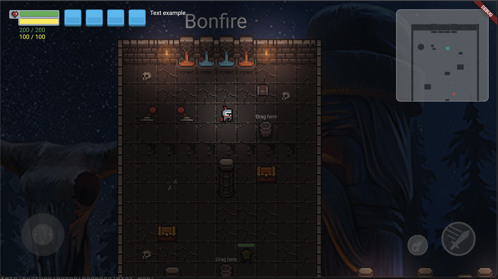

# MiniMap

> Widget useful to show a mini-map in yout game.



```dart
 return BonfireTiledWidget(
   ...
    overlayBuilderMap: {
    'miniMap': (context, game) => MiniMap(
            game: game,
            margin: EdgeInsets.all(20),
            borderRadius: BorderRadius.circular(10),
            size: Vector2.all(constraints.maxHeight / 3),
            border: Border.all(color: Colors.white.withOpacity(0.5)),
            // backgroundColor: Color(),
            // tileCollisionColor: Color(),
            // tileColor: Color(),
            // playerColor: Color(),
            // enemyColor: Color(),
            // npcColor: Color(),
            // allyColor: Color(),
            // decorationColor: Color(),
        ),
    },
    initialActiveOverlays: [
        'miniMap',
    ],
);
```

## Custom

If you can customize your map, you can use the params `tileRender` and `componentsRender`.

### Default `tileRender`

```dart

MiniMapCustomRender<Tile> tilesRenderDefault() => (canvas, component) {
        if (component is ObjectCollision) {
          (component as ObjectCollision).renderCollision(
            canvas,
            widget.tileCollisionColor ?? Colors.black.withOpacity(0.5),
          );
        } else if (widget.tileColor != null) {
          (component as ObjectCollision).renderCollision(
            canvas,
            widget.tileColor!,
          );
        }
      };

```

### Default `componentsRender`

```dart

MiniMapCustomRender componentsRenderDefault() => (canvas, component) {
        if (component is ObjectCollision) {
          if (component is GameDecoration) {
            component.renderCollision(
              canvas,
              widget.decorationColor ?? Colors.black.withOpacity(0.5),
            );
          }
          if (component is Player) {
            component.renderCollision(
              canvas,
              widget.playerColor ?? Colors.cyan.withOpacity(0.5),
            );
          } else if (component is Ally) {
            component.renderCollision(
              canvas,
              widget.allyColor ?? Colors.yellow.withOpacity(0.5),
            );
          } else if (component is Enemy) {
            component.renderCollision(
              canvas,
              widget.playerColor ?? Colors.red.withOpacity(0.5),
            );
          } else if (component is Npc) {
            component.renderCollision(
              canvas,
              widget.npcColor ?? Colors.green.withOpacity(0.5),
            );
          }
        }
      };

```