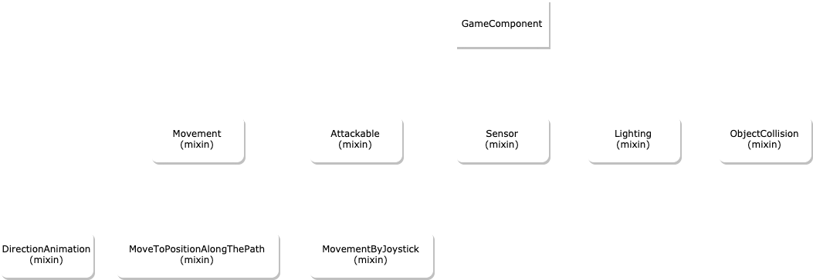

# Mixins

> With mixin you can add different behaviors to your component


Below you will see the tree of the main mixins currently available::

</img>


## Movement

Mixin responsible for adding movements.

Your component will gain properties like:

```dart
    bool isIdle = true;
    double speed = 100;
    Direction lastDirection = Direction.right;
    Direction lastDirectionHorizontal = Direction.right;
```

And methods to movement your component. (These movements take collisions into account.)

```dart
    void moveUp(double speed, {VoidCallback? onCollision})
    void moveDown(double speed, {VoidCallback? onCollision})
    void moveLeft(double speed, {VoidCallback? onCollision})
    void moveRight(double speed, {VoidCallback? onCollision})
    void moveUpRight(double speedX, double speedY, {VoidCallback? onCollision})
    void moveUpLeft(double speedX, double speedY, {VoidCallback? onCollision})
    void moveDownLeft(double speedX, double speedY, {VoidCallback? onCollision})
    void moveDownRight(double speedX, double speedY,{VoidCallback? onCollision})
    void moveFromAngle(double speed, double angle, {VoidCallback? onCollision})
    void moveFromAngleDodgeObstacles(double speed, double angle, {VoidCallback? onCollision,})
```

## DirectionAnimation

> To use this mixin your component must contain `Movement` mixin.

Mixin responsible for adding animations to movements.

You need set a SimpleDirectionAnimation:

```dart
class MyComponent extends GameComponent with Movement, DirectionAnimation{
    MyComponent(){
        animation = SimpleDirectionAnimation();
    }
}
```

## MoveToAlongThePath

> To use this mixin your component must contain `Movement` mixin.

Mixin responsible for find path using `a_star_algorithm` and moving the component through the path.

See [PathFinding](path_finding)

## AutomaticRandomMovement

> To use this mixin your component must contain `Movement` mixin.

Mixin responsible for adding random movement like enemy walking through the scene.

To use just need add `runRandomMovement` method in your update:

```dart

class MyComponent extends GameComponent with Movement, AutomaticRandomMovement{
    
    @override
    void update(double dt) {
        this.runRandomMovement(
            dt,
            speed: 20,
            maxDistance: 100,
        );
        super.update(dt);
    }
}

```

## MovementByJoystick

> To use this mixin your component must contain `Movement` and `JoystickListener` mixin.

Mixin responsible for adding movements through joystick events.

```dart
class MyComponent extends GameComponent with Movement, JoystickListener, MovementByJoystick{
    
}

```

That way if you add this component as a Joystick observer it will move when interacting with the joystick:

```dart

    MyComponent myComp = MyComponent();
    gameRef.joystickController?.addObserver(myComp);
    gameRef.camera.moveToTargetAnimated(myComp);

```

## Attackable

Mixin responsible for adding damage-taking behavior to the component.

Your component will gain properties like:

```dart
    double get maxLife;
    bool isDead;
    double life;
```

Adds these methods in your component:

```dart
    void initialLife(double life)
    void addLife(double life)
    void receiveDamage(double damage, dynamic from)
    void die()
```

## Vision

Mixin responsible for adding vision to component. Components like `Player`, `Npc` and `Decoration` use this mixin.

Your can draw the component vision do this:

```dart
    setupVision(
        drawVision:true,
    );
```

When you use any method like `seeComponent` or `seeComponentType` will draw the vision.

## Sensor

Mixin responsible for adding trigger to detect other objects above.

See [Sensor](sensor)

## Lighting

Mixin used to configure lighting in your component.

See [Lighting](lighting)

## ObjectCollision

Mixin responsible for adding collision.

See [ObjectCollision](collision_system)

## Pushable

Mixin responsible for enable push in the component.

You can do override the method `bool onPush(GameComponent component)` to control when can pushable. Returning true if the component is pushable, false otherwise. (default return true).

## UseAssetsLoader

Mixin used to load assets:

```dart
class MyComponent extends GameComponent with UseAssetsLoader{
    SpriteAnimation animation;
    MyComponent(Vector2 position,Future<SpriteAnimation> animIdle){
        this.position = position;
        loader?.add(AssetToLoad(animIdle, (value) {
            animation = value;
        }));
    }
}
```

## UseSpriteAnimation

Mixin that adds to your Component the use of the SpriteAnimation in easier way.
Your Component gains the `animation` property and `playSpriteAnimationOnce` method

```dart

class MyComponent extends GameComponent with UseSpriteAnimation{
    MyComponent(Vector2 position){
        this.position = position;
    }

    void playJump(){
        playSpriteAnimationOnce(MySpriteSheetLoader.getJumpAnimation());
    }

    @override
    Future onLoad() async {
        animation = await MySpriteSheetLoader.geAnimation();
        return super.onLoad();
    }
}

```