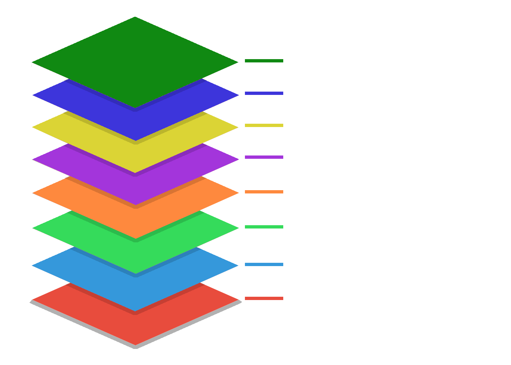

# Overview

Bonfire, is basically a Widget that passing the parameters and configuring according to your need will run the game.

```dart
@override
  Widget build(BuildContext context) {
    return BonfireTiledWidget(
      gameController: GameController(), // with the controller you can listen to all components of the game, control them and or add new ones.
      joystick: MyJoystick(), // required
      map: TiledWorldMap('tile/map.json', forceTileSize: tileSize), // required
      player: Knight(), // If player is omitted, the joystick directional will control the map view, being very useful in the process of building maps
      interface: KnightInterface(),
      background: GameComponent(), // to color you can use `BackgroundColorGame(Colors.blue)` or create your own background (to use parallax for example) extending from `GameComponent`
      constructionMode: false, // If true, activates hot reload to ease the map constructions and draws the grid
      showCollisionArea: false, // If true, show collision area of the elements
      constructionModeColor: Colors.blue, // If you wan customize the grid color.
      collisionAreaColor: Colors.blue, // If you wan customize the collision area color.
      lightingColorGame: Colors.black.withOpacity(0.4), // if you want to add general lighting for the game
      cameraConfig: CameraConfig(),
      showFPS: false, // If you wan show FPS.
      progress: Widget(), //progress that show while loading map.
    );
  }
```

> It is composed of several components that are rendered according to the layer diagram below.



We will understand each layer of this studying from the bottom up starting with the map.

## Background

> render_priority = 10

Your can add a component that represents a background. It's useful to create parallax and interactive backgrounds

## Map

> render_priority = 20

Represents a map (or world) where the game occurs.

For more details click [here](map).

## Decoration

> render_priority = Dynamic ( 30 + Axis Y)

Anything that you may add to the scenery. For example a Barrel in the way or even a NPC in which you can use to interact with your player.

For more details click [here](decoration).

## Enemy

> render_priority = Dynamic ( 30 + Axis Y)

Represents enemies characters in the game. Instances of this class has actions and movements ready to be used and configured whenever you want. At the same time, you can customize all actions and movements in the way that fits your needs.

For more details click [here](enemy).

## Player

> render_priority = Dynamic (30 + Axis Y)

Represents the character controlled by the user in the game. Instances of this class has actions and movements ready to be used and configured.

For more details click [here](player).

## Objects

> render_priority = Dynamic (30 +  Axis Y)

In this layer the components that `AnimatedObject` extends such as player attacks and enemies are rendered.

For more details click [here](objects).

## Lighting

> render_priority = (highestPriority + 10)

Layer responsible for adding lighting to the game.

For more details click [here](lighting).

## Game interface

> render_priority = (highestPriority + 30)

The way you cand raw things like life bars, stamina and settings. In another words, anything that you may add to the interface to the game.

For more details click [here](game_interface).

## Joystick

> render_priority = highestPriority + 40

The player-controlling component.

For more details click [here](joystick).


## Dynamically adding game elements

If it is necesssary to add a instance of a Bonfire's basic component class (Decorations, Enemy, etc), use:

```dart
this.gameRef.addGameComponent(COMPONENT);

/// or simply

this.gameRef.add(COMPONENT)
```