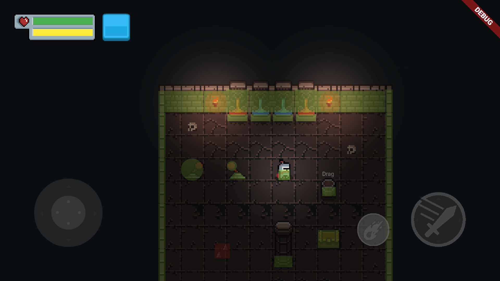

# 충돌 시스템

> 객체 간의 충돌을 결정하고 구성하는 시스템


## 사용 방법

3.0 버전에서는 [Flame CollisionDetection](https://docs.flame-engine.org/latest/flame/collision_Detection.html)을 사용하는 모든 충돌 시스템입니다.

컴포넌트에 충돌을 추가하려면 다음과 같이 'ShapeHitbox'(PolygonHitbox, RectangleHitbox 또는 CircleHitbox)를 추가하면 됩니다.

```dart

class MyComponent extends SimplePlayer {
  //...
  @override
  Future<void> onLoad() {
    add(RectangleHitbox(size:size));
    return super.onLoad();
  }
}

```

그 후 Flame은 게임 내 히트박스 간의 모든 충돌을 감지합니다. 이 메서드를 재정의하여 이 내용을 들을 수 있습니다.


```dart

class MyCollidable extends SimplePlayer {
  //...
  @override
  void onCollision(Set<Vector2> points, PositionComponent other) {
    if (other is ScreenHitbox) {
      //...
    } else if (other is YourOtherComponent) {
      //...
    }
  }

  @override
  void onCollisionEnd(PositionComponent other) {
    if (other is ScreenHitbox) {
      //...
    } else if (other is YourOtherComponent) {
      //...
    }
  }
}

```

이제 충돌이 언제 발생하는지 알 수 있지만 충돌이 발생해도 구성 요소가 움직임을 멈추지는 않습니다. 그렇게 하려면 다음과 같이 `BlockMovementCollision` 믹스인을 추가하면 됩니다.

```dart

class MyComponent extends SimplePlayer with  BlockMovementCollision{
  //...
  @override
  Future<void> onLoad() {
    add(RectangleHitbox(size:size));
    return super.onLoad();
  }
}

```

좋습니다! 이제 플레이어를 이동하고 `ShapeHitbox`를 사용하여 벽이나 다른 구성요소와 충돌하면 이동이 중지됩니다.

## 누가 충돌했는지 알아내기

`onBlockMovement` 또는 `onBlockedMovement`를 재정의하여 `GameComponent`가 충돌한 것을 알 수 있습니다.


```dart

class MyComponent extends SimplePlayer with  BlockMovementCollision{
  //...
  @override
  Future<void> onLoad() {
    add(RectangleHitbox(size:size));
    return super.onLoad();
  }

  @override
  bool onBlockMovement(
    Set<Vector2> intersectionPoints,
    GameComponent other,
  ) {
    // 충돌이 발생하면 뭔가를 할 수 있습니다. 따라서 false를 반환하면 차단 동작이 발생하지 않습니다.
    return super.onBlockMovement(intersectionPoints,other);
  }

  @override
  void onBlockedMovement(
    GameComponent other,
    Direction? direction,
    Vector2 lastDisplacement,
  ) {
     super.onBlockedMovement(other,direction,lastDisplacement);
     // 충돌로 인해 움직임이 차단되었을 때 뭔가를 할 수 있습니다.
  }
}
```

## 테스트 및 디버깅

충돌이 올바른 위치에 있는지 확인하려면 `BonfireWidget`에서 `showCollisionArea`를 활성화하면 됩니다.

```dart
    BonfireWidget(
        ...
        showCollisionArea:true,
        ...
    ),
```


