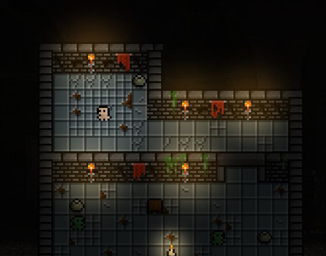

# 조

> <small>이것은 [GameComponent](https://github.com/RafaelBarbosatec/bonfire/blob/master/lib/base/game_comComponent.dart)입니다.</small>

> 주의: 이 믹스인은 임펠러 버그로 인해 IOS 장치에서 제대로 작동하지 않습니다. [문제](https://github.com/flutter/flutter/issues/132849)를 살펴보세요.

게임에 조명을 추가하는 역할을 담당하는 레이어입니다.

</img>

BonfireWidget에서 `lightingColorGame` 속성을 설정하면 이 조명 시스템이 자동으로 활성화됩니다. 객체에 조명을 추가하려면 `Lighting` 믹스인을 구성 요소에 추가하고 `setupLighting()` 메서드를 사용하여 구성하면 됩니다.

```dart
class MyCustomDecoration extends GameDecoration with Lighting {
  MyCustomDecoration(Position position)
      : super.withAnimation(
          Future<SpriteAnimation>(),
          size: Vector2(32,32),
          position: position,
        ){
          setupLighting(
            LightingConfig(
              radius: width * 1.5,
              color: Colors.transparent,
              // blurBorder: 20, // 이는 기본값입니다
              // type: LightingType.circle, // 이는 기본값입니다
              // useComponentAngle: false, // 이는 기본값입니다. 'angle' 매개변수를 변경할 때 실제 조명이 구성요소와 함께 회전하는 경우.
            ),
          );
        }

}
```

## 게임 색상 필터

프로그래밍 방식으로 게임에 색상 필터를 적용할 수 있습니다.

### BlendMode 및 색상

```dart
  gameRef.colorFilter.animateTo(Colors.blue, BlendMode.colorBurn);
```

