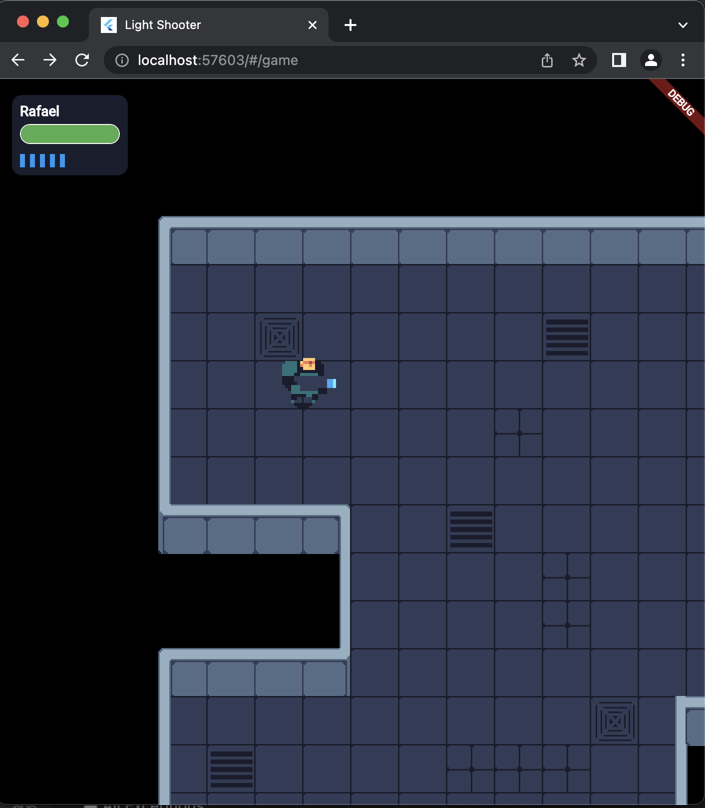

## Bonfire Example
[GitHub](https://github.com/RafaelBarbosatec/bonfire/tree/v3.0.0/example)    -   [Play other tab](https://bonfire-engine.github.io/examples/bonfire-v3/)

 

## SunnyPlace [In development]
> Game case

[PlayStore](https://play.google.com/store/apps/details?id=br.com.sunnyplace)

## Darkness Dungeon
[GitHub](https://github.com/RafaelBarbosatec/darkness_dungeon) - [PlayStore](https://play.google.com/store/apps/details?id=com.rafaelbarbosatec.darkness_dungeon)

## Mini Fantasy

[GitHub](https://github.com/RafaelBarbosatec/mini_fantasy)   -   [PLAY](https://bonfire-engine.github.io/examples/mini_fantasy/)

## Light Shooter

Online game that use [Nakama game server](https://flutter-nakama.gitbook.io/flutter-nakama/)

[GitHub](https://github.com/RafaelBarbosatec/light_shooter) - 
[Video](https://twitter.com/RafaBarbosaTec/status/1656049304413274113)

## Defector

Game submitted to [Midyear 2022 Flame Game Jam](https://itch.io/jam/2nd-flame-game-jam/rate/1672215)

[GitHub](https://github.com/RafaelBarbosatec/defector)   -   [PLAY](https://rafaelbarbosatec.itch.io/defector)

## Turn game

[GitHub](https://github.com/RafaelBarbosatec/turn_game)

## Npc neural

Simple implementation of the training of NPC using Neural Network perceptron and Bonfire

[GitHub](https://github.com/RafaelBarbosatec/npc_neural_training)    -   [Play other tab](https://bonfire-engine.github.io/examples/neural-network)

 

