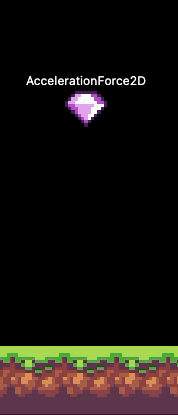
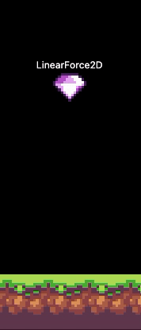
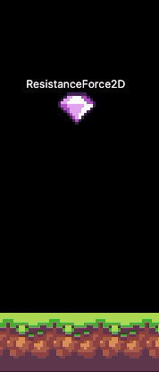

# Forças

Bonfire tem um sistema de forças simples que você pode adicionar aos seus jogos: forças lineares, de aceleração ou de resistência.

| AccelerationForce2D | LinearForce2D    | ResistanceForce2D    |
| :---:   | :---: | :---: |
|  |    |    |


## Usando a Força

Para adicionar forças globais, basta adicioná-las ao parâmetro `globalForces` do `BonfireWidget`:

```dart
@override
  Widget build(BuildContext context) {
    return BonfireWidget(
      // ...
      globalForces: [] // Aqui você pode adicionar forças como acelerações (AccelerationForce2D), resistências
    );
  }
```

Todos os componentes que usam o mixin `HandleForces` serão afetados por essa força. Assim:

```dart
class MyCustomDecoration extends GameDecoration with HandleForces {

}
```

Você pode adicionar uma força a um componente específico. Basta adicionar um mixin `HandleForces` e chamar a função `addForce`:


```dart
class MyCustomDecoration extends GameDecoration with HandleForces {

  MyCustomDecoration() {
    addForce((AccelerationForce2D('gravity', Vector2(0,50))));
    // removeForce('gravity'); para remover.
  }
}
```

## Forças Disponíveis

- `AccelerationForce2D` -> Aplicar aceleração à velocidade
- `ResistanceForce2D` -> Aplique resistência à velocidade tentando zerar
- `LinearForce2D` -> Aplicar força linear à velocidade

Você pode criar sua própria `force` criando uma classe e estendendo da classe `Force2D`.

> Você também pode editar a massa do componente. Basta fazer `mass = 2`
