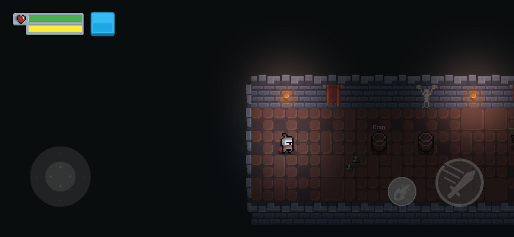

# Joystick

> <small>This is a [JoystickController](https://github.com/RafaelBarbosatec/bonfire/blob/master/lib/joystick/joystick_controller.dart)</small>

The player-controlling component.

## Joystick



There is a pre-included implementation (`Joystick`) ready to use, but also configurable to add a custom looking or even add as many actions as you will.

Or you can implement `JoystickController` yourself and emit event trough a `JoystickListener`.

Joystick is configurable by the following parameters:
```dart
  return BonfireWidget(
    joystick: Joystick(
        directional: JoystickDirectional(
          spriteBackgroundDirectional: Sprite.load('joystick_background.png'), //directinal control background
          spriteKnobDirectional: Sprite.load('joystick_knob.png'), // directional indicator circle background
          color: Colors.black, // if you do not pass  'pathSpriteBackgroundDirectional' or  'pathSpriteKnobDirectional' you can define a color for the directional.
          size: 100, // directional control size
          isFixed: false, // enables directional with dynamic position in relation to the first touch on the screen
        ),
        actions: [
          JoystickAction(
            actionId: 1, //(required) Action identifier, will be sent to 'void joystickAction(JoystickActionEvent event) {}' when pressed
            sprite: Sprite.load('joystick_atack_range.png'), // the action image
            spritePressed: Sprite.load('joystick_atack_range.png'), // Optional image to be shown when the action is fired
            spriteBackgroundDirection: Sprite.load('joystick_background.png'), //directinal control background
            enableDirection: true, // enable directional in action
            align: JoystickActionAlign.BOTTOM_RIGHT,
            color: Colors.blue,
            size: 50,
            margin: EdgeInsets.only(bottom: 50, right: 160),
          )
        ],
    ),
    ...
  );
```

Check a [example](https://github.com/RafaelBarbosatec/bonfire/blob/master/example/lib/main.dart).

## JoystickListener

Mixin used to listen the joystick interactions.

A component that use this mixin can listen the Joystick events adding as observer:

```dart

gameRef.addJoystickObserver(myComponentJoystickListener);

```