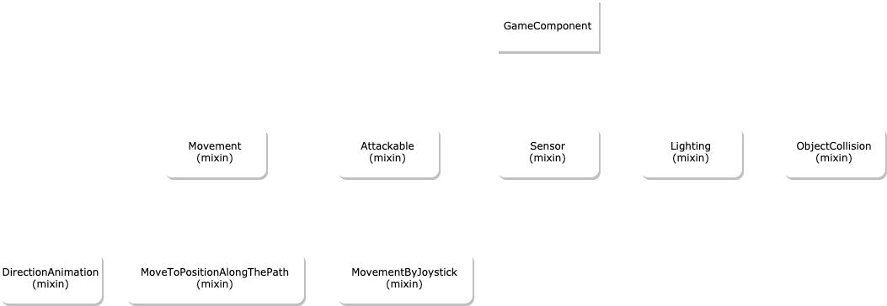

# Mixins

> With mixin you can add different behaviors to your component

Below you will see the tree of the main mixins currently available:

</img>

## Movement

Mixin responsible for adding movements.

Your component will gain properties like:

```dart
double speed = 80;
double velocityRadAngle = 0.0;
Vector2 displacement = Vector2.zero();
Vector2 velocity = Vector2.zero();
Vector2 acceleration;
Direction lastDirection = Direction.right;
Direction lastDirectionHorizontal = Direction.right;
Direction lastDirectionVertical = Direction.down;
```

And methods to move your component:

```dart
void moveUp({double? speed})
void moveDown({double? speed})
void moveLeft({double? speed})
void moveRight({double? speed})
void moveUpRight({double? speed})
void moveUpLeft({double? speed})
void moveDownLeft({double? speed})
void moveDownRight({double? speed})
void moveFromAngle(double angle, {double? speed})
void moveFromDirection(Direction direction, {bool enabledDiagonal = true})
bool moveToPosition(Vector2 position, {double? speed, bool useCenter = true})
void stopMove({bool forceIdle = false, bool isX = true, bool isY = true})
void translate(Vector2 displacement)
void moveLeftOnce({double? speed})
```

You can listen when the movement changes:

```dart
@override
void onMove(
    double speed,
    Vector2 displacement,
    Direction direction,
    double angle,
) {}
```

## DirectionAnimation

> To use this mixin your component must contain the `Movement` mixin.

Mixin responsible for adding animations to movements.

You need set a `SimpleDirectionAnimation`:

```dart
class MyComponent extends GameComponent with Movement, DirectionAnimation {
    MyComponent() {
        animation = SimpleDirectionAnimation(...);
    }
}
```

You can replace the `SimpleDirectionAnimation` using:

```dart
Future<void> replaceAnimation(
    SimpleDirectionAnimation newAnimation, {
    bool doIdle = true,
})
```

In the `SimpleDirectionAnimation` there are some methods util to control the animation:

```dart
/// Method used to play animation one time using `other` map
animation.playOnceOther()

/// Method used to play animation one time
animation.playOnce(
    FutureOr<SpriteAnimation> animation, {
        VoidCallback? onFinish,
        VoidCallback? onStart,
        bool runToTheEnd = false,
        bool flipX = false,
        bool flipY = false,
        bool useCompFlip = false,
        Vector2? size,
        Vector2? offset,
    },
);

/// Method used to play specific animation registered in `others`
animation.playOther(String key, {bool flipX = false, bool flipY = false});

/// Method used to register new animation in others
animation.addOtherAnimation(
    String key,
    FutureOr<SpriteAnimation> animation,
);

animation.pause();
animation.resume();
```

## PathFinding

> To use this mixin, your component must contain the `Movement` mixin.

Mixin responsible for finding paths using `a_star_algorithm` and moving the component through the path.

See [PathFinding](doc/path_finding)

## UseLifeBar

> To use this mixin your component must contain the `Attackable` mixin.

Mixin used to add a BarLife to an attackable component.

With this mixin you can configure the life bar view using the method `setupLifeBar`:

```dart
void setupLifeBar({
    Vector2? size,
    Color? backgroundColor,
    Color? borderColor,
    double borderWidth = 2,
    List<Color>? colors,
    BorderRadius? borderRadius,
    BarLifeDrawPosition barLifeDrawPosition = BarLifeDrawPosition.top,
    Vector2? offset,
    Vector2? textOffset,
    TextStyle? textStyle,
    bool showLifeText = true,
    BarLifeTextBuilder? barLifetextBuilder,
})
```

## RandomMovement

> To use this mixin your component must contain the `Movement` mixin.

Mixin responsible for adding random movement like an enemy walking through the scene.

To use it, just add `runRandomMovement` in your `update`:

```dart
class MyComponent extends GameComponent with Movement, RandomMovement {
    @override
    void update(double dt) {
        runRandomMovement(dt);
        super.update(dt);
    }
}
```

All parameters:

```dart
void runRandomMovement(
    double dt, {
    double? speed,
    double maxDistance = 50,
    double minDistance = 25,

    /// milliseconds
    int timeKeepStopped = 2000,
    bool updateAngle = false,
    bool checkDirectionWithRayCast = false,
    RandomMovementDirections directions = RandomMovementDirections.all,
    Function(Direction direction)? onStartMove,
    Function()? onStopMove,
})
```

## MovementByJoystick

> To use this mixin your component must contain `Movement` and `PlayerControllerListener` mixins.

Mixin responsible for adding movements through joystick events.

```dart
class MyComponent extends GameComponent
    with Movement, PlayerControllerListener, MovementByJoystick {
    MyComponent() {
        setupMovementByJoystick(
            moveType: MovementByJoystickType.direction,
            intensityEnabled: false,
            diagonalEnabled: true,
            enabled: true,
        );
    }
}
```

That way, if you add this component as a joystick observer, it will move when interacting with the joystick:

```dart
MyComponent myComp = MyComponent();
gameRef.joystickController?.addObserver(myComp);
gameRef.camera.moveToTargetAnimated(myComp);
```

You can disable this behavior by calling `setupMovementByJoystick(enabled: false)`.

## Attackable

> Used by: `Player`, `Ally`, `Enemy`

Mixin responsible for adding damage-taking behavior to the component.

Your component will gain properties like:

```dart
double maxLife;
double life;
bool isDead;
```

Adds these methods to your component:

```dart
void initialLife(double life)
void addLife(double life)
void updateLife(double life, {bool verifyDieOrRevive = true})
void removeLife(double life)

/// Called when the component receives damage
void onReceiveDamage(
    AttackOriginEnum attacker,
    double damage,
    dynamic identify,
)

/// This method is used to check if this component can receive damage from an attacker.
bool checkCanReceiveDamage(AttackOriginEnum attacker)

// Called when life is removed
void onRemoveLife(double life)

// Called when life is restored
void onRestoreLife(double life)

/// Called when life reaches 0
void onDie()

/// Called when the component revives
void onRevive()

/// Get the rect collision of the component used to receive damage
Rect rectAttackable()
```

## Vision

Mixin responsible for adding vision to the component. Components like `Player`, `Npc` and `Decoration` use this mixin.
Your component gains `seeComponent` and `seeComponentType` methods.

You can draw the component vision like this:

```dart
setupVision(
    color: Colors.red,
    drawVision: true,
    countPolygonPoints: 20,
);
```

When you use any method like `seeComponent` or `seeComponentType`, the engine will determine the vision.

## Sensor

Mixin responsible for adding a trigger to detect other objects above it.

See [Sensor](doc/sensor)

## Lighting

Mixin used to configure lighting in your component.

See [Lighting](doc/lighting)

## BlockMovementCollision

Mixin responsible for stopping the movement when a collision happens.

See [ObjectCollision](doc/collision_system)

## Pushable

> To use this mixin your component must contain the `Movement` mixin.

Mixin responsible for enabling push behavior on the component.

You can override the method `bool onPush(GameComponent component)` to control when it is pushable. Returning `true` if the component is pushable, `false` otherwise. (default returns `true`).

## Follower

This mixin makes your component follow the position of a target.
Your component gains the properties: `followerTarget` and `followerOffset`.
You can configure your target like this:

```dart
setupFollower(target: myPlayer, offset: Vector2());
```

If a component that has this mixin is added as a child of another component, it will follow the parent position.

## UseAssetsLoader

Mixin used to load assets:

```dart
class MyComponent extends GameComponent with UseAssetsLoader {
    SpriteAnimation? animation;
    MyComponent(Vector2 position, Future<SpriteAnimation> animIdle) {
        this.position = position;
        loader?.add(AssetToLoad(animIdle, (value) {
            animation = value;
        }));
    }
}
```

## UseSpriteAnimation

Mixin that adds easy use of `SpriteAnimation` to your component.
Your component gains the `animation` property and `playSpriteAnimationOnce` method.

```dart
class MyComponent extends GameComponent with UseSpriteAnimation {
    MyComponent(Vector2 position) {
        this.position = position;
    }

    void playJump() {
        playSpriteAnimationOnce(MySpriteSheetLoader.getJumpAnimation());
    }

    @override
    Future<void> onLoad() async {
        setAnimation(await MySpriteSheetLoader.getAnimation());
        return super.onLoad();
    }
}
```

You can know the current animation index or if it is the last frame:

```dart
bool get isAnimationLastFrame
int get animationCurrentIndex
bool get isPaused
```

## UseSprite

Mixin that adds easy use of `Sprite` to your component.
Your component gains the `sprite`.

```dart
class MyComponent extends GameComponent with UseSprite {
    MyComponent(Vector2 position) {
        this.position = position;
    }

    @override
    Future<void> onLoad() async {
        sprite = await MySpriteSheetLoader.getSprite();
        return super.onLoad();
    }
}
```

### TileRecognizer

Mixin used to recognize the type of tiles below the component.

In the Tiled program used to build your map, you can set a `class` or custom properties. With this mixin you can access this `Tile` information that the component is above.

```dart
/// Method that checks what type map tile is currently below
String? tileTypeBelow();

/// Method that checks what types map tile is currently below
List<String> tileTypeListBelow();

/// Method that checks what properties map tile is currently below
Map<String, dynamic>? tilePropertiesBelow();

/// Method that checks what properties list map tile is currently below
List<Map<String, dynamic>>? tilePropertiesListBelow();

/// Method that checks what map tiles is below
Iterable<Tile> tileListBelow();
```

### ElasticCollision

Mixin responsible for giving elastic collision behavior (experimental). You can configure it using the method `setupElasticCollision`.

```dart
void setupElasticCollision({
    bool enabled = true,
    double restitution = 2.0,
})
```
